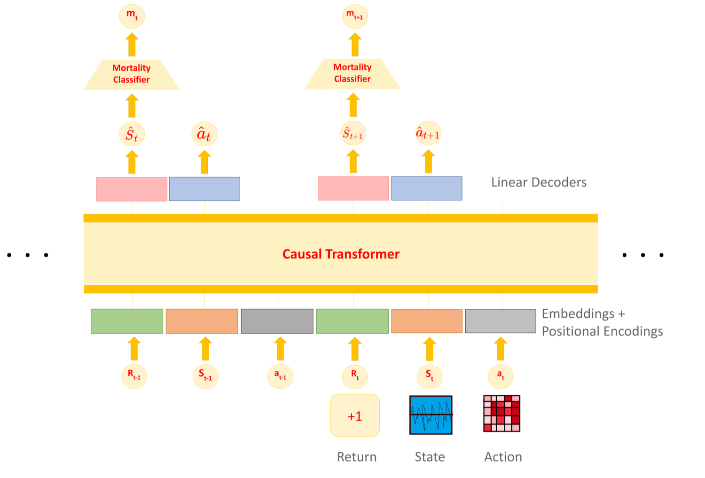

<div align="center">

# 🩺 PosNegDM: Reinforced Sequential Decision-Making for Sepsis Treatment

**A transformer-based decision-maker with a mortality classifier that learns from positive _and_ negative demonstrations to recommend sepsis treatments.**

Dipesh Tamboli · Jiayu Chen · Kiran Pranesh Jotheeswaran · Denny Yu · Vaneet Aggarwal

_IEEE Journal of Biomedical and Health Informatics (JBHI), 2024_

[](https://arxiv.org/abs/2403.07309)
[](https://ieeexplore.ieee.org/document/10472521)
[](LICENSE)

</div>

---

## 💡 Overview

Sepsis is a life-threatening condition with high mortality, and treatment decisions are sequential and highly patient-specific. **PosNegDM** — *"Reinforcement Learning with Positive and Negative Demonstrations for Sequential Decision-Making"* — frames sepsis treatment as offline sequential decision-making. It couples a **causal transformer** (a Decision-Transformer-style policy over returns, states, and actions) with a **mortality classifier** that steers the policy toward survival-positive trajectories. Across comparisons with Decision Transformer and Behavioral Cloning baselines, PosNegDM substantially improves simulated patient survival.

## 🧠 Framework

<div align="center">

</div>

Returns (`R`), states (`S`), and actions (`a`) are embedded with positional/timestep encodings and passed through a **causal transformer**; linear decoders predict the next state `Ŝ` and action `â`, and a **mortality classifier** predicts the survival signal `m` at each step, guiding the model toward positive outcomes.

## 🚀 Getting started

Install dependencies:

```bash
pip install -r requirements.txt        # minimal deps; see environment.yml for the exact frozen env
```

A small **sample dataset** is provided in [`data/`](data) for a quick demonstration. For real experiments, use the MIMIC-III database — [physionet.org/content/mimiciii/1.4](https://physionet.org/content/mimiciii/1.4/) — which we cannot redistribute due to its licensing.

**Train the decision-maker:**

```bash
python train.py
```

## 🧩 Mortality classifier

The mortality classifier is trained on trajectory **observations** exported from the decision-making pipeline. These are stored as `data/observations.json` — a JSON list `[X_train, labels, X_test]` of feature vectors and their outcome labels (produced from the MIMIC-III trajectories; not redistributable). Place your `observations.json` under `data/`, then:

```bash
python nnclsfier/trainandval.py    # train the mortality classifier (with BorderlineSMOTE balancing)
python nnclsfier/predmort.py       # evaluate a trained classifier (loads data/NNMortalityborder.pth)
python nn_train.py                 # standalone classifier training variant
```

## 📦 Repository structure

| Path | Description |
|------|-------------|
| `train.py` | Main entry point — trains the PosNegDM decision-maker |
| `dualsight/` | Decision-Transformer-style stack: `models/` (`decision_transformer.py`, `trajectory_gpt2.py`, `mlp_bc.py`), `training/`, `evaluation/` |
| `nnclsfier/` | Mortality classifier — `trainandval.py` (train), `predmort.py` (evaluate) |
| `nn_train.py` | Standalone mortality-classifier training script |
| `data/` | Sample data (`sample_data.csv`) and a pretrained weight (`NNfinal.pth`) |
| `utils.py` | Helper utilities |
| `environment.yml` | Full frozen conda environment |

## ⚙️ Requirements

Developed on **PyTorch 2.3** / Python 3.10. `requirements.txt` lists the minimal packages (torch, transformers, numpy, pandas, scikit-learn, imbalanced-learn, matplotlib, tqdm); `environment.yml` captures the exact frozen environment.

## 📚 Citation

```bibtex
@article{tamboli2024reinforced,
  title   = {Reinforced Sequential Decision-Making for Sepsis Treatment: The PosNegDM Framework with Mortality Classifier and Transformer},
  author  = {Tamboli, Dipesh and Chen, Jiayu and Jotheeswaran, Kiran Pranesh and Yu, Denny and Aggarwal, Vaneet},
  journal = {IEEE Journal of Biomedical and Health Informatics},
  year    = {2024},
  publisher = {IEEE},
  doi     = {10.1109/JBHI.2024.3377214}
}
```

## 📄 License

Released under the [MIT License](LICENSE).
